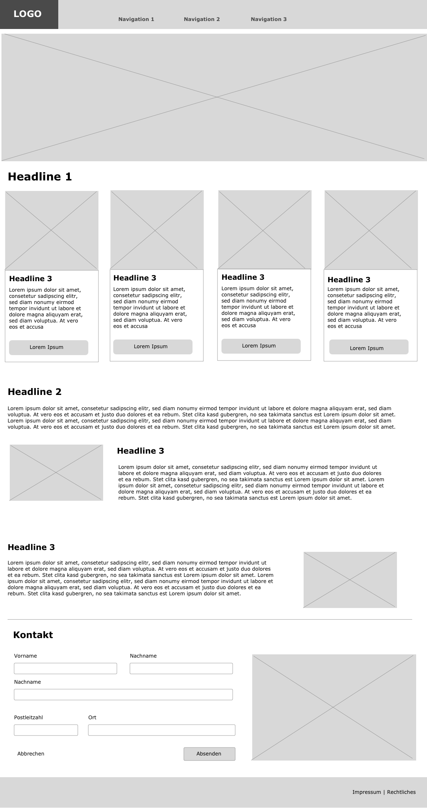

# HTML-CSSLearning
FirstWebsite
## todos
1.Responsive
2.vinculum.html
-->Tabelle
-->Flexbox

# Übung 1
siehe:
1. https://css-tricks.com/snippets/css/a-guide-to-flexbox/
2. https://kulturbanause.de/blog/die-chrome-entwicklertools-devtools-fuer-designer-und-einsteiger/
3. https://www.mediaevent.de/html/html5-tags.html

